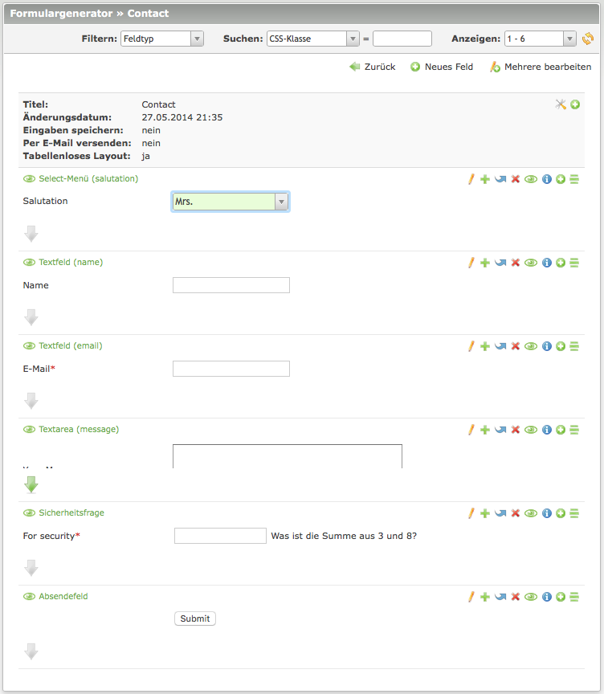
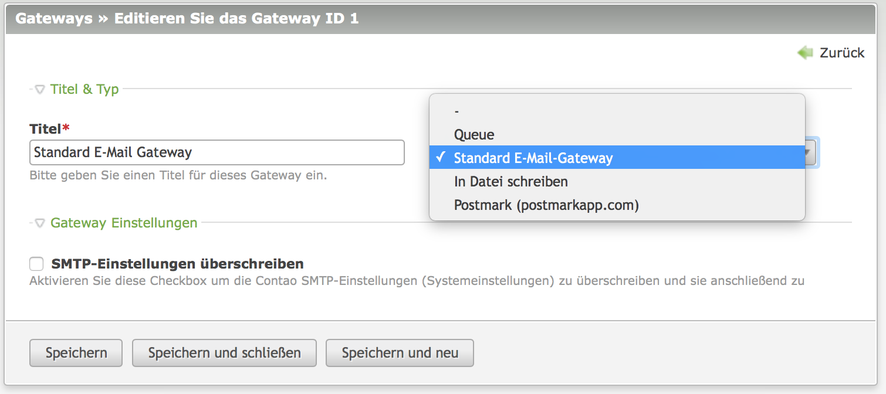
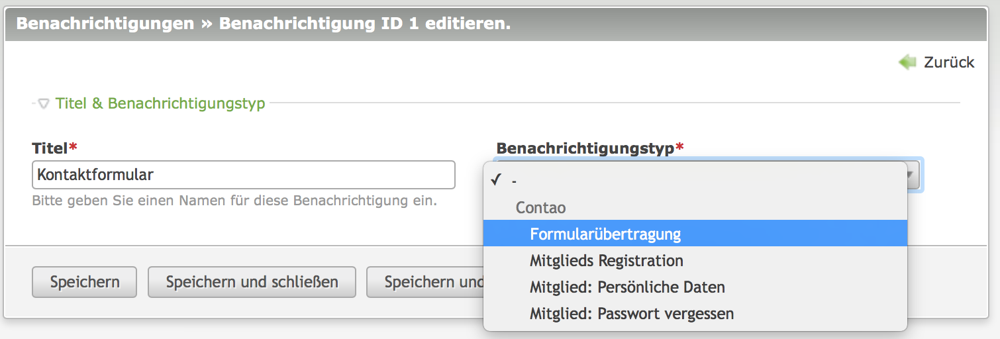
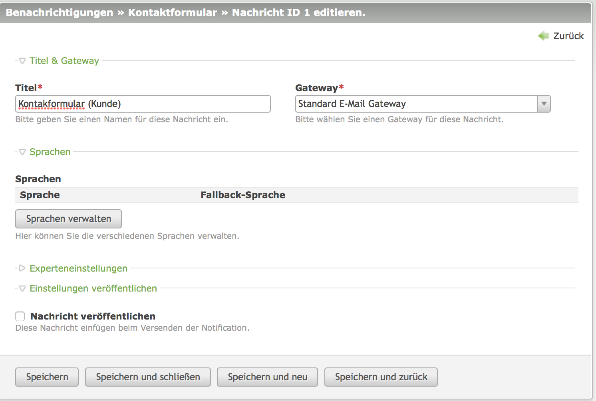
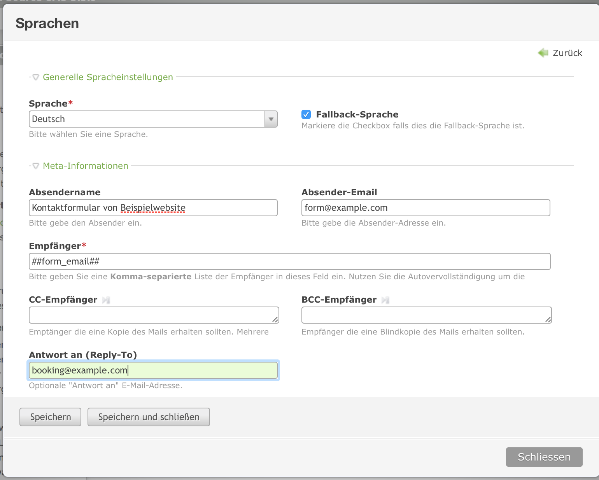
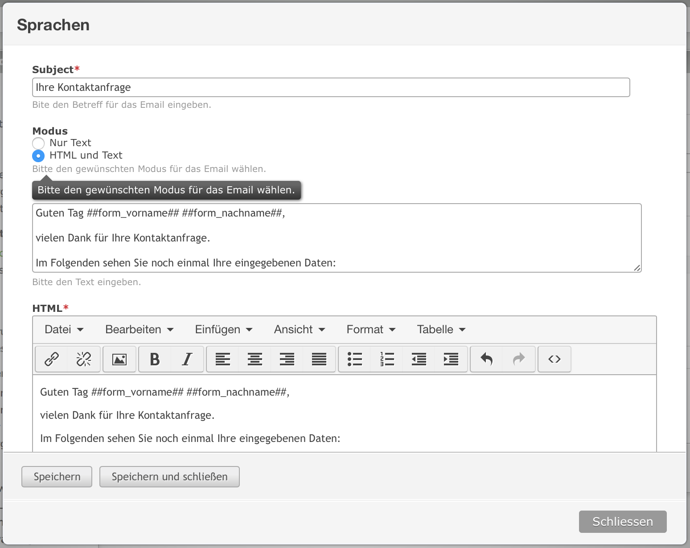
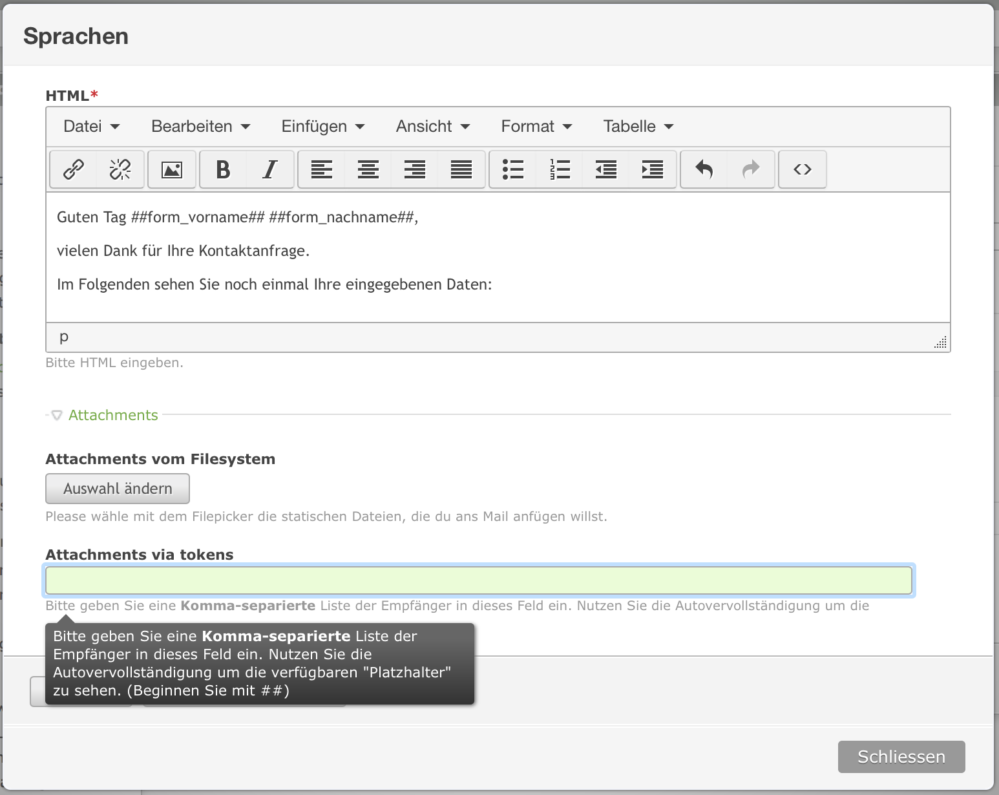
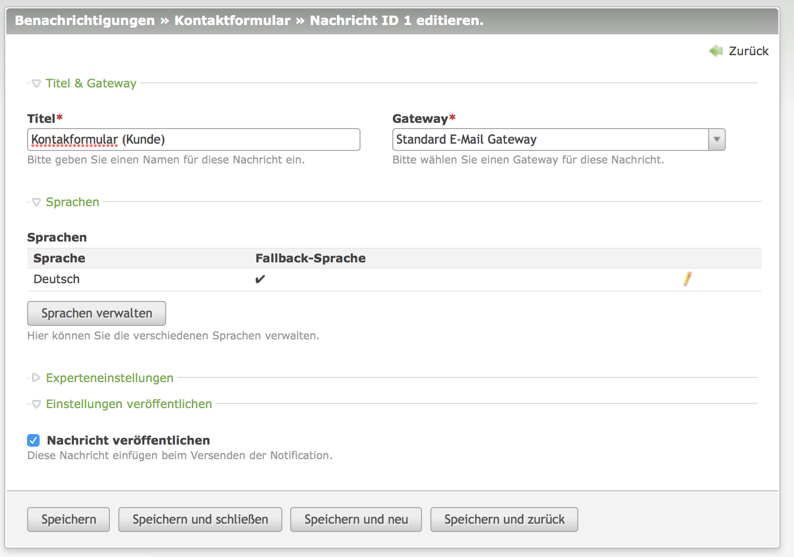

# Notification Center

Notification Center ist eine Erweiterung für das Content Management System Contao. Es ermöglicht es, an verschiedenen
Stellen vom System Benachrichtigungen verschicken zu lassen. Diese Funktionalität ist in Teilen bereits im Grundsystem 
enthalten, Notification Center erweitert den Funktionsumfang hier jedoch deutlich.

## Installation

Der empfohlene Weg ist die Verwendung von der Paketverwaltung (`composer`) im Contao Backend. Der Name des Pakets
ist `terminal42/notification_center`. 

Nach erfolgreicher Installation sind im Contao Menü weitere Punkte zu sehen:

## Einrichtung

Um Notification Center verwenden zu können müssen zunächst Gateways und Benachrichtigungen angelegt werden. Mit einem 
Gateway wird festgelegt, wie Benachrichtigungen zu verschicken sind (per E-Mail, per SMS, oder auch als Schreiben in 
eine Datei). 

### Gateways

* Der E-Mail-Versand (Standard E-Mail-Gateway) dürfte wohl der gängigste Fall sein. Wenn z.B. im Frontend ein Formular
abgeschickt wird, soll eine Bestätigungs E-Mail erzeugt und verschickt werden.
* Soll zusätzlich auch der Betreiber der Website benachrichtigt werden ist evtl. das Gateway "In Datei schreiben" 
hilfreich, damit er nicht eine Flut von E-Mails erhält.
* Das "Postmark (psotmarkapp.com)" Gateway ist eine Beispiel für die Implementierung eines Gateways, das über einen
externen Anbieter verschickt.

### Benachrichtigung

Bei den Benachrichtigungen wird konfiguriert, welche Daten im verarbeitet werden sollen und von welchem Gateway sie 
behandelt werden sollen. Eine "Benachrichtigung" enthält dabei einen oder mehrere Teile. Am Beispiel Kontaktformular:  
zum einen die Benachrichtigung des Users, der das Formular abgeschickt hat und zum anderen z.B. die Benachrichtigung 
des Websitebetreibers.

## Ein komplettes Beispiel

Am einfachsten ist dies an einem Beispiel zu verstehen, das alle benötigten Schritte zeigt. Die gestellte Aufgabe soll 
wie oben bereits angesprochen ein Kontatformular sein, bei dem der Absender eine Bestätigungs E-Mail erhält und der 
Betreiber der Website ebenfalls benachrichtigt werden soll.

### Kontaktformular erstellen

Wir beginnen mit der Erstellung des Kontaktformulars. Dies hat zunächst nichts mit Notification Center zu tun und
wird wie in Contao üblich gemacht. Wir verwenden im Beispiel das Formular `Contact` aus der Offizielle Contao-Demo
(https://contao.org/de/erweiterungsliste/view/official_demo.de.html). Hier ist zunächst noch nichts Notification Center 
betreffendes zu tun.

### Gateway konfigurieren

Gateways → Neues Gateway

Wir wollen Benachrichtigungen per E-Mail verschicken und legen daher – falls noch nicht geschehen –   
ein Gateway ("Standard E-Mail-Gateway") an.

### Benachrichtigungen anlegen

Benachrichtigungen → neue Benachrichtigung

Als nächstes legen wir die Benachrichtigung an, die beim Verarbeiten des Formulars verschickt werden sollen.

Hier muss zunächst nur angegeben werden, wann die Benachrichtigung verschickt werden soll. Im Beispiel: 
Bei der "Formularübertragung".

Danach müssen mit "Neue Nachricht" je Empfänger die Details der Benachrichtigung konfiguriert werden. 

Durch einen Klick auf den Button "Sprachen verwalten" und dann "Neue Sprache" fügen wir den Text der Benachrichtigung
in der jeweiligen Sprache hinzu. (siehe die nächsten drei Abbildungen, die alle Teile eines Popups sind).

Zuletzt muss noch "Nachricht veröffentlichen" gesetzt werden

Da mit Notification Center Benachrichtigungen mehrere Teile haben können wiederholen wir die obigen Schritte für alle
Teile. Dachach haben wir folgenden Stand, an dem im Beispiel eine E-Mail an den Kunden geschickt werden soll, der das
Formular ausfüllt und eine E-Mail an die Fachabteilung, die die Anfrage des Kunden bearbeiten soll.

### Kontaktformular Benachrichtigung zuweisen

Nachdem nun alles konfiguriert ist, muss im bereits erstellten Kontaktformular nun noch festgelegt werden, daß
eine Benachrichtigung veranlasst werden soll. Dies geschieht durch auswahl im Dropdown "Benachrichtigung" und ist
nicht mit Contaos Standardmechanismus zu verwechseln, der gleich darunter durch "Per E-Mail versenden" ausgewählt 
werden kann! 

TODO: Screenshot

TODO: evtl. Screenshot wenn auch `leads` installiert ist

## Ausblick

Daten speichern mit `terminal42/contao-leads`

