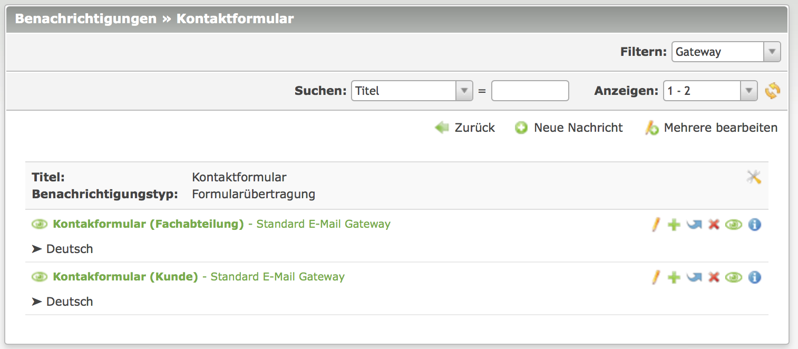

# Notification Center

Notification Center ist eine Erweiterung für das Content Management System Contao. Es ermöglicht es, an verschiedenen
Stellen vom System Benachrichtigungen verschicken zu lassen. Diese Funktionalität ist in Teilen bereits im Grundsystem 
enthalten, Notification Center erweitert den Funktionsumfang hier jedoch deutlich.

## Installation

Der empfohlene Weg ist die Verwendung von der Paketverwaltung (`composer`) im Contao Backend. Der Name des Pakets
ist `terminal42/notification_center`. 

Nach erfolgreicher Installation sind im Contao Menü weitere Punkte zu sehen:

## Einrichtung

Um Notification Center verwenden zu können müssen zunächst Gateways und Benachrichtigungen angelegt werden. Mit einem 
Gateway wird festgelegt, wie Benachrichtigungen zu verschicken sind (per E-Mail, per SMS, oder auch als Schreiben in 
eine Datei). 

### Gateways

* Der E-Mail-Versand (Standard E-Mail-Gateway) dürfte wohl der gängigste Fall sein. Wenn z.B. im Frontend ein Formular
abgeschickt wird, soll eine Bestätigungs E-Mail erzeugt und verschickt werden.
* Soll zusätzlich auch der Betreiber der Website benachrichtigt werden ist evtl. das Gateway "In Datei schreiben" 
hilfreich, damit er nicht eine Flut von E-Mails erhält.
* Das "Postmark (psotmarkapp.com)" Gateway ist eine Beispiel für die Implementierung eines Gateways, das über einen
externen Anbieter verschickt.

### Benachrichtigung

Bei den Benachrichtigungen wird konfiguriert, welche Daten im verarbeitet werden sollen und von welchem Gateway sie 
behandelt werden sollen. Eine "Benachrichtigung" enthält dabei einen oder mehrere Teile. Am Beispiel Kontaktformular:  
zum einen die Benachrichtigung des Users, der das Formular abgeschickt hat und zum anderen z.B. die Benachrichtigung 
des Websitebetreibers.

## Ein komplettes Beispiel

Am einfachsten ist dies an einem Beispiel zu verstehen, das alle benötigten Schritte zeigt. Die gestellte Aufgabe soll 
wie oben bereits angesprochen ein Kontatformular sein, bei dem der Absender eine Bestätigungs E-Mail erhält und der 
Betreiber der Website ebenfalls benachrichtigt werden soll.

### Kontaktformular erstellen

Wir beginnen mit der Erstellung des Kontaktformulars. Dies hat zunächst nichts mit Notification Center zu tun und
wird wie in Contao üblich gemacht. Wir verwenden im Beispiel das Formular `Contact` aus der Offizielle Contao-Demo
(https://contao.org/de/erweiterungsliste/view/official_demo.de.html). Hier ist zunächst noch nichts Notification Center 
betreffendes zu tun.

### Benachrichtigungen anlegen

* neue Nachricht hinzufügen

* Neue Sprache anlegen

### Kontaktformular Benachrichtigung zuweisen

TODO: Screenshot

TODO: evtl. Screenshot mit Schnittstelle zu leads

## Ausblick

Daten speichern mit `terminal42/contao-leads`

