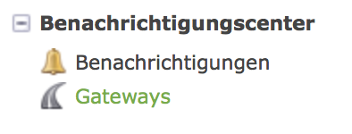

# Notification Center

Notification Center ist eine Erweiterung für das Content Management System Contao. Es ermöglicht, an verschiedenen
Stellen vom System Benachrichtigungen verschicken zu lassen. Diese Funktionalität ist in Teilen bereits im Grundsystem
enthalten, Notification Center erweitert den Funktionsumfang hier jedoch deutlich.


## Installation

Der empfohlene Weg ist die Verwendung von der Paketverwaltung (`composer`) im Contao Backend. Der Name des Pakets
ist `terminal42/notification_center`.

Nach erfolgreicher Installation sind im Contao Menü weitere Punkte zu sehen:




## Einrichtung

Um Notification Center verwenden zu können müssen zunächst Gateways und Benachrichtigungen angelegt werden. Mit einem
Gateway wird festgelegt, wie Benachrichtigungen zu verschicken sind (per E-Mail, per SMS, oder auch als Schreiben in
eine Datei).


### Gateways

* Der E-Mail-Versand (Standard E-Mail-Gateway) dürfte wohl der gängigste Fall sein. Wenn z.B. im Frontend ein Formular
abgeschickt wird, soll eine Bestätigungs E-Mail erzeugt und verschickt werden.
* Soll zusätzlich auch der Betreiber der Website benachrichtigt werden ist evtl. das Gateway "In Datei schreiben"
hilfreich, damit dieser nicht eine Flut von E-Mails erhält.
* Queue schickt die Nachrichten zunächst in eine Warteschleife, wo sie dann von der eigentlichen Versandart abgearbeitet werden. Diese Option ist aber auch hilfreich, wenn man beim Einrichten der Benachrichtigungen nicht so viele Mails senden/empfangen möchte, sondern nur deren Inhalt auslesen und die zur Verfügung stehenden Parameter erkunden möchte.
* Das "Postmark (psotmarkapp.com)" Gateway ist eine Beispiel für die Implementierung eines Gateways, das über einen
externen Anbieter verschickt.


### Benachrichtigungen

Bei den Benachrichtigungen wird konfiguriert, welche Daten im Notification Center verarbeitet werden sollen und von
welchem Gateway sie behandelt werden sollen. Eine "Benachrichtigung" enthält dabei einen oder mehrere Teile. Am
Beispiel Kontaktformular: zum einen die Benachrichtigung des Users, der das Formular abgeschickt hat und zum anderen
z.B. die Benachrichtigung des Websitebetreibers.
Benachrichtigungen können folgende Typen sein:
* Formularübertragung: Hier werden Nachrichten konfiguriert, die nach dem Absenden eines Formulars versendet werden sollen. Dieses Formular muss im Formulargenerator angelegt werden.
* Mitgieds Registration: Hier werden Nachrichten konfiguriert, die bei der Registrierung eines neuen Mitglieds (Frontenduser) versendet werden.
* Mitglied: Persönliche Daten - Hier werden Nachrichten konfiguriert, die nach der Änderung von persönlichen Daten eines Mitglieds versendet werden.
* Mitglied: Passwort vergessen - Hier werden Nachrichten konfiguriert, die bei Klick auf den "Passwort vergessen"-Link versendet werden.


## Ein komplettes Beispiel

Am einfachsten ist dies an einem Beispiel zu verstehen, das alle benötigten Schritte zeigt. Die gestellte Aufgabe soll,
wie oben bereits angesprochen, ein Kontatformular sein, bei dem der Absender eine Bestätigungs E-Mail erhält und der
Betreiber der Website ebenfalls benachrichtigt werden soll.


### Kontaktformular erstellen

Wir beginnen mit der Erstellung des Kontaktformulars. Dies hat zunächst nichts mit Notification Center zu tun und
wird wie in Contao üblich gemacht. Wir verwenden im Beispiel das Formular `Contact` aus der Offizielle Contao-Demo
(https://contao.org/de/erweiterungsliste/view/official_demo.de.html). Hier ist zunächst noch nichts zu beachten, was
mit dem Notification Center zu tun hätte.


### Gateway konfigurieren

Gateways → Neues Gateway

Wir wollen Benachrichtigungen per E-Mail verschicken und legen daher – falls noch nicht geschehen –   
ein Gateway ("Standard E-Mail-Gateway") an.
Sollen die Nachrichten nicht über den Standard-Account versendet werden, kann man hier eigene SMTP-Einstellungen angeben. (Standard-Account meint hier, die in den Systemeinstellungen gemachten Angaben. Sind dort keine SMTP-Einstellungen hinterlegt, wird über php mail versendet.)


### Benachrichtigungen anlegen

Benachrichtigungen → neue Benachrichtigung

Als nächstes legen wir die Benachrichtigung an, die beim Verarbeiten des Formulars verschickt werden sollen.


Hier muss zunächst nur angegeben werden, wann die Benachrichtigung verschickt werden soll. Im Beispiel:
Bei der "Formularübertragung".

Danach müssen mit "Neue Nachricht" je Empfänger die Details der Benachrichtigung konfiguriert werden.


Durch einen Klick auf den Button "Sprachen verwalten" und dann "Neue Sprache" fügen wir den Text der Benachrichtigung
in der jeweiligen Sprache hinzu (siehe die nächsten drei Abbildungen, die alle Teile eines Popups sind).


TODO: neuer Screenshot, da die verwendeten Simple Tokens nicht zum Beispielformular passen! (müsste z.B. ##form_name## heißen etc.)


Zuletzt muss noch "Nachricht veröffentlichen" gesetzt werden


Da mit Notification Center Benachrichtigungen mehrere Teile haben können wiederholen wir die obigen Schritte für alle
gewünschten Teile. Dachach haben wir folgenden Stand, an dem im Beispiel eine E-Mail an den Kunden geschickt werden
soll, der das Formular ausfüllt und eine E-Mail an die Fachabteilung, die die Anfrage des Kunden bearbeiten soll.


### Kontaktformular Benachrichtigung zuweisen

Nachdem nun alles konfiguriert ist, muss im bereits erstellten Kontaktformular noch festgelegt werden, daß eine
Benachrichtigung veranlasst werden soll. Dies geschieht durch auswahl im Dropdown "Benachrichtigung" und ist
nicht mit Contaos Standardmechanismus zu verwechseln, der gleich darunter durch "Per E-Mail versenden" ausgewählt
werden kann!


TODO: Screenshot

TODO: evtl. Screenshot wenn auch `leads` installiert ist

## Simple Tokens

Durch die Verwendung von Simple Tokens kann in den Benachrichtigungen auf die im Formular
übermittelten Daten zugegriffen werden.

Beispiel:
```
Guten Tag ##form_salutation## ##form_name##,

vielen Dank für Ihre Kontaktanfrage.
```

Hier werden die Formularfelder `salutation` und `name` im Text der E-Mail verwendet.

Weitere Erklärungen zu Simple Tokens finden sich auch in der [Isotope-Dokumentation](https://isotopeecommerce.org/de/handbuch/v/2.3/r/simple-tokens.html "zur Isotope-Dokumentation")

Zu beachten ist aber, dass auf der angegebenen Seite ein Bepiel für eine personalisierte Anrede steht, das so nicht funktioniert. Der zu vergleichende Wert im if-Statement muss der Labelwert sein. ('Weiblich' statt 'female'). Für unser Formular bedeutet das:
```
{if form_salutation=="Mr."}
Sehr geehrter Herr ##form_lastname##,
{elseif form_salutation=="Mrs."}
Sehr geehrte Frau ##form_lastname##,
{else}
Sehr geehrte Damen und Herren,
{endif}

```


## Ausblick

Daten speichern mit `terminal42/contao-leads`
Eventanmeldung mit 'terminal42/contao-leads' und 'kmielke/calendar-extended'
